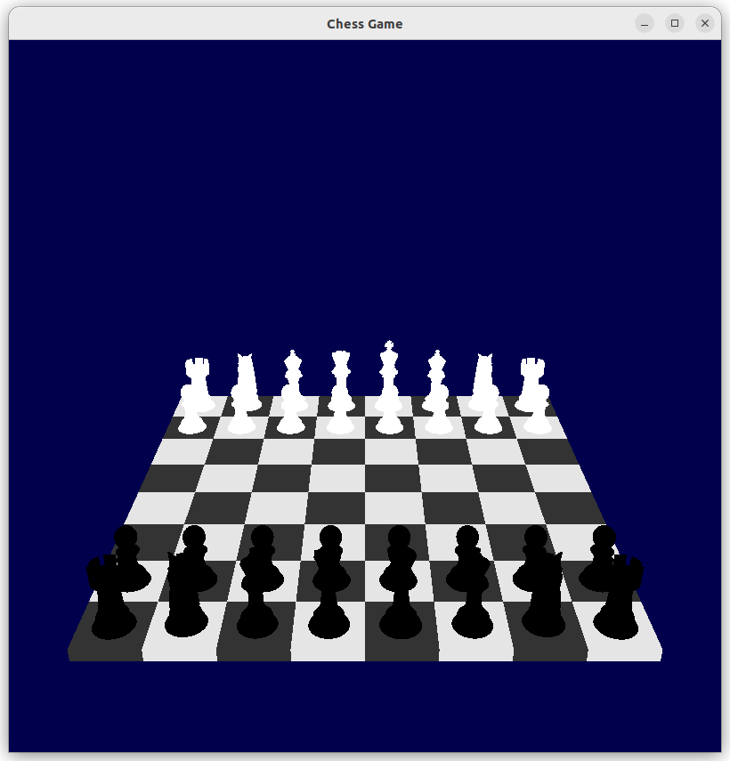

# Projet Échecs OpenGL

## Description

La branche par défaut `dev_texture` contient la version la plus récente du projet. Malgré mes efforts récents, il ne s'agit pas encore d'un jeu d'échecs complet en 3D. Les résultats d'exécution ne sont pas totalement satisfaisants. Et cette version ne contient pas la programmation des règles du jeu. Les règles du jeu sont incluses dans la branche `2Dgame`.

### Branches disponibles

- **Branche `2Dgame` :**  
  Cette branche permet d'exécuter un jeu simple en 2D. Les pièces blanches et noires jouent à tour de rôle. Les règles de déplacement des pièces sont implémentées, et les captures de pièces sont possibles. Cependant, les formes des pièces n'ont pas été détaillées.

- **Branche `master` :**  
  Cette branche permet de visualiser les modèles 3D. Voici un exemple d'affichage :

  
  
